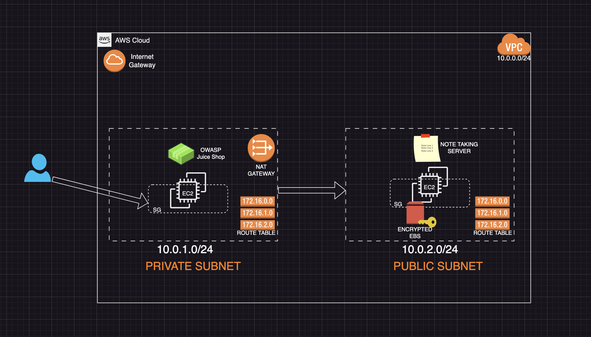

# AWS Vulnerable Lab Deployment 🛡️

Automated deployment of a secure vulnerable environment featuring:
- OWASP Juice Shop (Docker) in public subnet
- Encrypted EBS volume in private subnet
- VPC with NAT/Internet Gateway
- Infrastructure-as-Code (Terraform + Ansible)

## 🔥 Features
- Secure Network Architecture (Public/Private Subnets)
- Vulnerability Testing Environment (Juice Shop)
- Encrypted Storage (AWS KMS + EBS)
- Bastion Host Configuration
- Cost-Optimized (Free Tier Compatible)

## 🧰 Technical Stack
| Component       | Technology       |
|-----------------|------------------|
| Infrastructure  | Terraform        |
| Configuration   | Ansible          |
| Cloud Provider  | AWS              |
| Vulnerable App  | OWASP Juice Shop |
| Networking      | VPC, NAT Gateway |

## 🔒 Security Implementation
- **Network Security**
  - Restricted SSH access (IP whitelisting)
  - Security Group Least Privilege
  - Private subnet isolation
- **Data Protection**
  - EBS Volume Encryption (AWS KMS)
  - No sensitive data in version control
- **Access Control**
  - Key Pair Authentication
  - IAM Role Best Practices

  ## 🚀 Deployment Guide

### Prerequisites
- AWS Account (Free Tier)
- Terraform ≥1.5
- Ansible ≥2.14
- AWS CLI Configured

### Deployment Steps
1. Clone repository:
   ```bash
   git clone https://github.com/yourusername/AWS-Vulnerable-Lab.git

   ```

2. Initialize Terraform:

```bash
cd terraform && terraform init
```

3. Deploy infrastructure:
```bash
terraform apply -var="key_name=your-key" -var="my_ip=$(curl -s ifconfig.me)/32"
```

4. Run Ansible playbooks:
```bash
ansible-playbook -i inventory.ini public.yml
ansible-playbook -i inventory.ini private.yml
```


---

#### **Visual Documentation**

## 📐 Architecture Diagram
```markdown

```
**Component Legend:**
- Public Subnet: Juice Shop Docker Container
- Private Subnet: Encrypted EBS Volume
- Security Groups: Filtered Traffic
- NAT Gateway: Outbound Internet for Private Subnet

## ✅ Verification Steps

### Juice Shop Access
```bash
curl http://$(terraform -chdir=terraform output -raw public_ip)
```

EBS Volume Check
```bash
ansible private -i inventory.ini -m shell -a "df -h /mnt/secret_notes"
```

Security Validation
```bash
terraform validate
ansible-lint ansible/*.yml
```

## 🚨 Common Issues & Fixes

| Error | Solution |
|-------|----------|
| `InvalidAMIID.NotFound` | Update AMI filter in variables.tf |
| `SSH Connection Failed` | Verify Security Group rules |
| `EBS Mount Failure` | Check device mapping in /dev/ |
| `Docker Port Conflict` | Stop existing containers: `docker stop juice_shop` |

## 🎓 Skills Demonstrated
- Infrastructure as Code (Terraform)
- Configuration Management (Ansible)
- AWS Networking (VPC, Subnets, Route Tables)
- Security Best Practices (Encryption, SG Rules)
- Vulnerability Management (OWASP Top 10)

## 🔄 Future Improvements
- [ ] Implement CI/CD Pipeline
- [ ] Add Monitoring (CloudWatch)
- [ ] Automated Vulnerability Scans
- [ ] Multi-AZ Deployment
